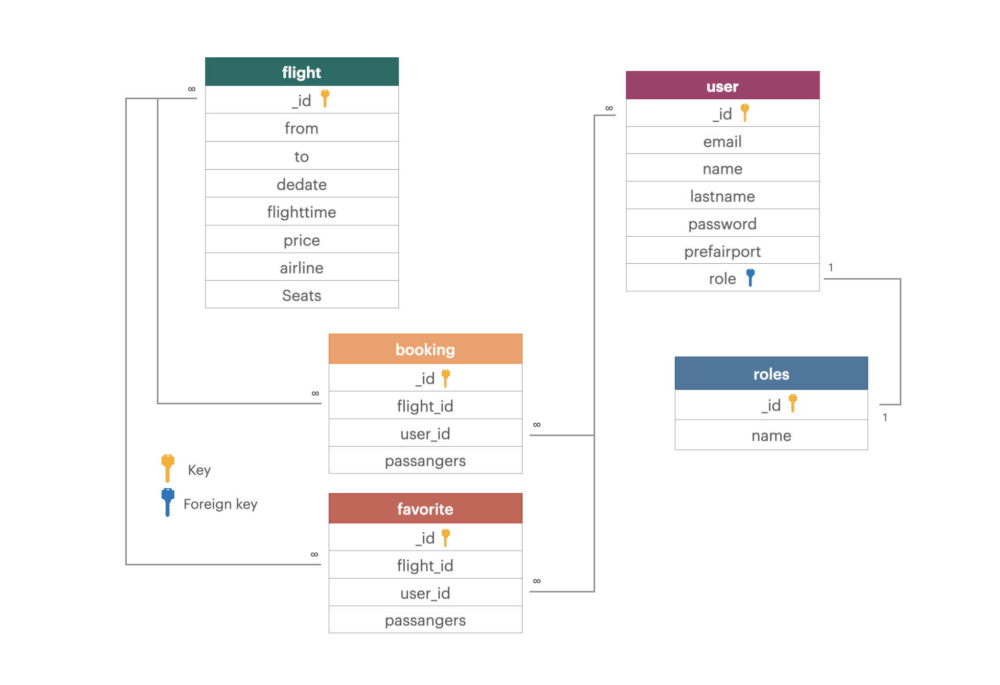
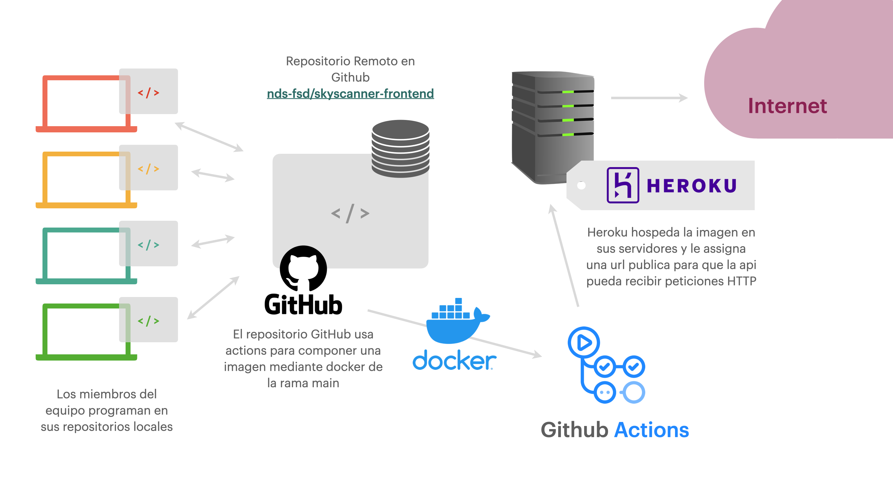

# Skyscanner - Backend (API)

Skyscanner es un proyecto llevado a cabo por un equipo de desarrolladores del master en Full Stack Developement de la escuela Nuclio Digital School. El objeto del proyecto es un aplicativo web full stack orientado a la búsqueda y gestión de vuelos nacionales. Entre otras funcionalidades la aplicación ofrece al usuario funciones como la aplicación de filtros sobre los resultados, la creación y gestión de sesiones de usuario y la posibilidad de guardar y reservar vuelos entre otras.

## Acceso API

La api esta alojada en los servidores ofrecidos por Heroku y el deploy se realizó mediante el uso de Docker. La URL publica y accesible es https://skyscanner-backend.herokuapp.com/. Si quisiera ser usada de manera local los pasos a seguir para su instalación son los descritos a continuación.
### Instalación en local
En primer lugar debemos clonar el repositoria a nuestra máquina local usando:
```bash
git clone https://github.com/nds-fsd/skyscanner-backend.git
```
*Se debe tener en cuenta que al tratarse de un repositorio privado, se requieren ciertos permisos para acceder al código.*

Una vez, clonado el código debemos instalar todas las dependencias con el comando:
```bash
npm install
```
Una vez hecho instalados todos los paquetes ya se puede levantar la aplicación mediante: 
```bash
npm start
```
Una vez hecho todo esto ya tendremos nuestra aplicación corriendo en https://localhost:3000.
## Descripción técnica
La aplicación es capaz de recibir peticones HTTP (API REST), procesarlas y generar una respuesta adecuada para ellas. Esto se consigue gracias al framework **Express**.

</br>


</br>

Por otro lado, la aplicación se conecta y guarda los datos a una BBDD de MongoDB, ala cual accederemos mediante el servicio cloud **Mongo Atlas**.

</br>


</br>

Todo esto se consigue trabajando bajo el paraguas del motor de ejecución **nodeJs**.

</br>


</br>

## Esquema Base de Datos

La base de datos se organiza de la siguiente manera:



## Librerias
Las librerias usadas en la aplicación son:

| Liberia | Utilidad |
| ----------- | ----------- |
| Mongoose | Gestión de la base de datos |
| bcrypt | Encriptacion y desencriptación de datos confidenciales del usuario|
| dotenv | Uso de variables de entorno |
| cors | Uso recursos tipo cross-origin |
| jsonwebtoken | Creación de JSON Web Tokens |
| morgan | Midelware de logs para peticiones HTTP |
| express-validator | Validación de datos en las peticiones |

Todas ellas han sido instaladas y gestionadas mediante el gestor de paquetes **npm**.
## Pieza de código destacables

Una parte del codigo que nos gustaria mencionar es la función de guardar una reserva.

```JSX
try {
    bookingController.saveBooking = async (req, res) => {
        const booking = req.body;
    
        const bookingExists = await BookingModel.findOne({
            ...booking
        }).exec();

        if (bookingExists){
            return res.status(409).send({
                message:"Este vuelo ya está reservado"
            });
        }

        const bookingSaved = await BookingModel.create({
            ...booking,
        });

        await FlightsModel.findByIdAndUpdate(
            { _id: booking.flight_id },
            { $inc: {
                seats: - booking.passangers
                }
            }
        );

        res.status(201).json(bookingSaved);
    };
} catch (error) {
    res.status(500).send(error);
}
```
Esta función recoge el objeto reserva, comprueba si ya existe este objeto en la BBDD, si es así responde para avisar al cliente, si no es asi guarda el obejeto en base de datos y posteriormente accede al objeto vuelo asociado a la reserva y reduce el valor del atributo seats en función de los pasajeros de dicha reserva.

## Deploy
El dolpoy se ejecuta tal y como muestra la siguiente ilustración:


## Mapa estructural del código

```
backend
├─ .DS_Store
├─ .git
├─ .gitignore
├─ README.md
├─ data
│  ├─ airlines-data.json
│  ├─ airports-data.json
│  ├─ allflights-data.json
│  ├─ flights-data.json
│  └─ images
│     ├─ express.png
│     ├─ mongo.png
│     └─ node.png
├─ index.js
├─ node_modules
├─ package-lock.json
├─ package.json
└─ src
   ├─ controllers
   │  ├─ airline.controller.js
   │  ├─ airport.controller.js
   │  ├─ booking.controller.js
   │  ├─ favorite.controller.js
   │  ├─ flights.controller.js
   │  ├─ login.controller.js
   │  ├─ profile.controller.js
   │  └─ user.controller.js
   ├─ models
   │  ├─ airlines.model.js
   │  ├─ airport.model.js
   │  ├─ booking.model.js
   │  ├─ favorite.model.js
   │  ├─ flights.model.js
   │  └─ user.model.js
   └─ routers
      ├─ airlines.router.js
      ├─ airports.router.js
      ├─ booking.router.js
      ├─ favorite.router.js
      ├─ flights.router.js
      ├─ profile.router.js
      └─ user.router.js

```
## Contribuyentes
El equipo que ha llevado a cabo el proyecto esta formado por:
- Eric Capella ([Github Account](https://github.com/ericcapella))
- Carolina Marianela Gallegos ([Github Account](https://github.com/CarolinaMarianela))
- Jose Luis Conejero ([Github Account](https://github.com/jlcrayo))
- Marc Cuesta Martínez ([Github Account](https://github.com/marccuesta99))
